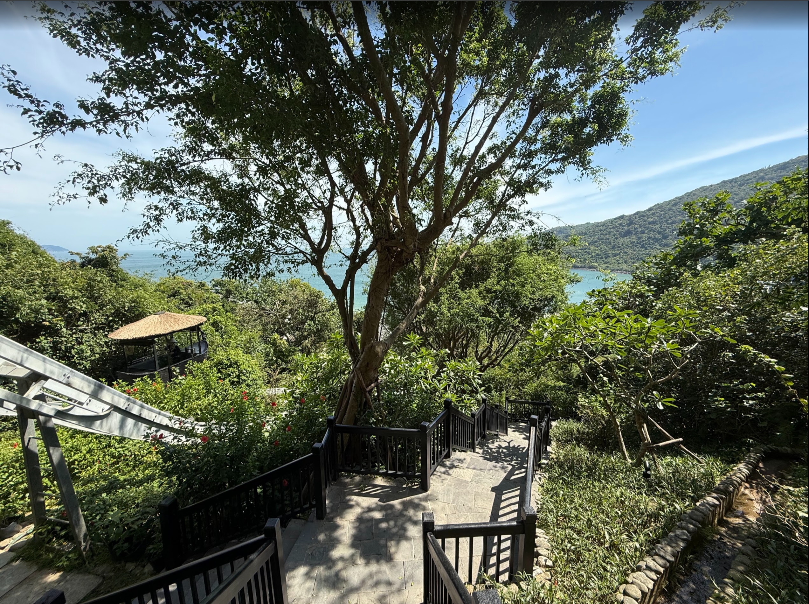

# About Me



Hello! My name is Scott, and I'm a student at UCSD studying Computer Science.

> "Step by step walk the thousand-mile road." - Miyamoto Musashi

---

## My Interests

*   **Programming**
*   *Mathematics*
*   *Traveling*
*   *Art*


## 😆

```python
def cat():
    art = """
     /\_/\
    ( o.o )
     > ^ <
    """
print(art)
```

## Links

*   [GitHub Profile](https://github.com/phamhscott)
*   [UCSD CSE](https://cse.ucsd.edu/)
*   [Interests](#my-interests)
*   [Projects](./projects.md)
*   [README](./README.md)
*   [Link to my picture](image.png)

## My Goals

1.  Visit a new country.
2.  Learn another programming language.
3.  Take more photos.

### Task List

- [x] ~~Set up GitHub User Page~~
- [ ] Add projects to my portfolio

\
